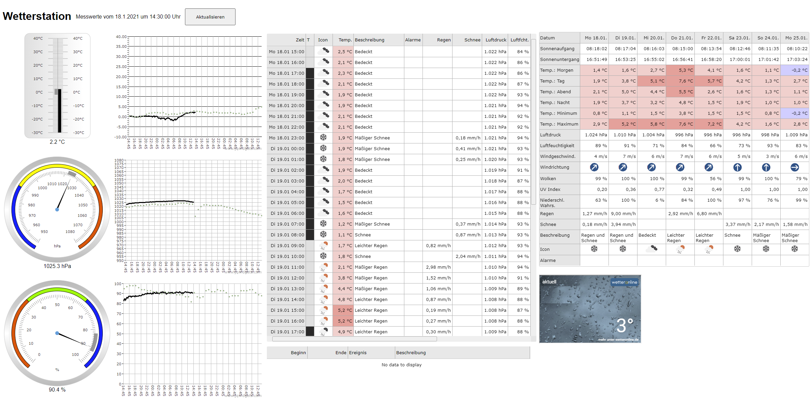
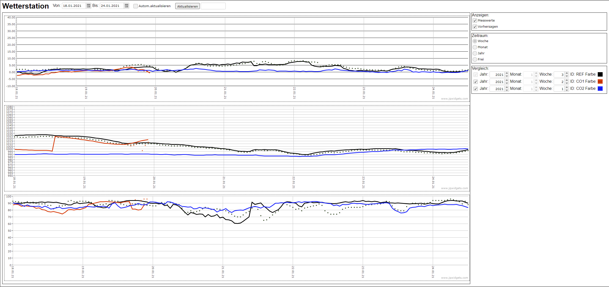

# snweather-ui

This package includes a Web UI for <https://github.com/signag/snweatherstation>.
It visualizes measured weather data along with forecast data obtained from the archive database of **snweatherstation**.

Widgets on this page make use of the jQWidgets framework <https://www.jqwidgets.com/>.

**snweatherstation** obtains forecast data from <https://openweathermap.org/>

## Overview

### Main page

- current measurement,
- comparison measuremenr vs. forecast for the last 24 hours
- forecast for the next 24 hours
- table with 3-day openweathermap hourly forecast and alerts (all data from One Call API)
- table with 8-day forecast data

### Archive data

- Historical graphics for temperature, pressure and humidity
- selectable reference period
- selectable periods for comparison

## Installation

Download / clone the package to your web server deploy directory (e.g. Apache htdocs).

Adjust scripts/connect.php with the valid database connection for the [snweatherstation](https://github.com/signag/snweatherstation) database.

The main page URL is **/snweather-ui/index.php**.
